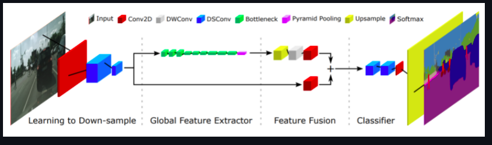

# fast-scnn-implementation
My implementation of Fast-SCNN: Fast Semantic Segmentation Network

Fast-SCNN shares the computations between two branches (encoder) to build a above real-time semantic segmentation network

# ABSTRACT from Paper :
The encoder-decoder framework is state-of-the-art for
offline semantic image segmentation. Since the rise in autonomous systems, real-time computation is increasingly
desirable. 

In this paper, we introduce fast segmentation
convolutional neural network (Fast-SCNN), an above realtime semantic segmentation model on high resolution image data (1024 × 2048px) suited to efficient computation on embedded devices with low memory. 

Building on existing two-branch methods for fast segmentation, we introduce
our ‘learning to downsample’ module which computes lowlevel features for multiple resolution branches simultaneously. Our network combines spatial detail at high resolution with deep features extracted at lower resolution, yielding an accuracy of 68.0% mean intersection over union at
123.5 frames per second on Cityscapes. 

# Foundation of Semantic Segmentation :
State-of-the-art semantic segmentation DCNNs combine
two separate modules: the encoder and the decoder. The encoder module uses a combination of convolution and pooling operations to extract DCNN features. The decoder module recovers the spatial details from the sub-resolution features, and predicts the object labels (i.e. the semantic segmentation) . 

Most commonly, the encoder is adapted from a simple classification DCNN method, such as VGG or ResNet. In semantic segmentation, the fully connected layers are removed.
The seminal fully convolution network (FCN) laid the foundation for most modern segmentation architectures.
Specifically, FCN employs VGG as encoder, and bilinear upsampling in combination with skip-connection from lower layers to recover spatial detail. 

U-Net furtherexploited the spatial details using dense skip connections
